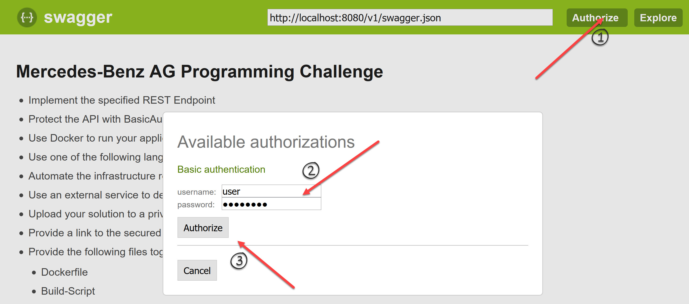
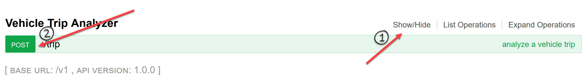
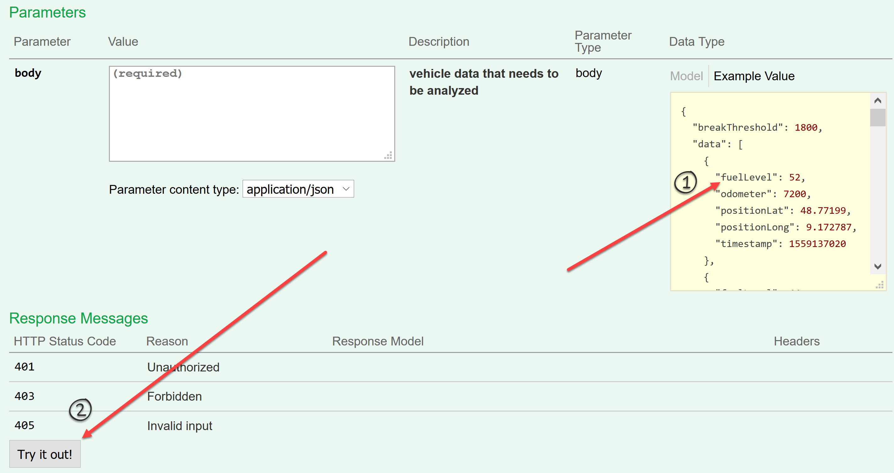
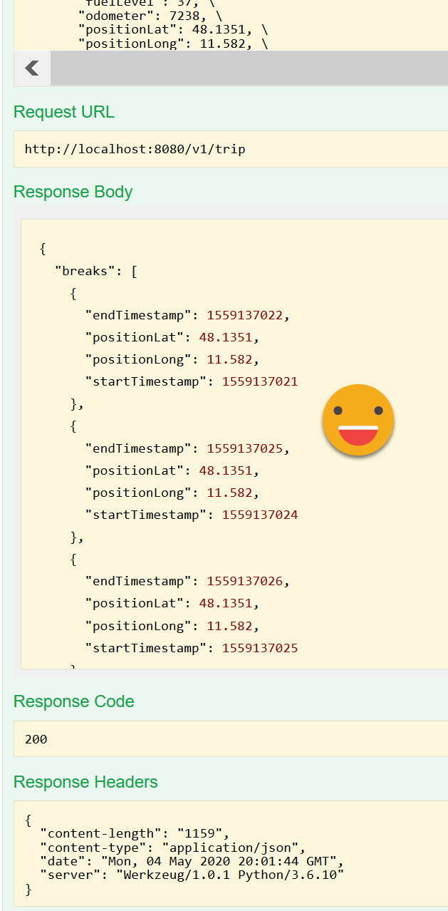

# Vehicle Trip Analyzer 

## Overview
This server was generated by the [swagger-codegen](https://github.com/swagger-api/swagger-codegen) project. By using the
[OpenAPI-Spec](https://github.com/swagger-api/swagger-core/wiki) from a remote server, you can easily generate a server stub. This
is a Python application that was built upon a swagger-enabled Flask server.

This microservice uses the [Connexion](https://github.com/zalando/connexion) library on top of Flask.

## Requirements
Python 3.6+

## Usage
To run the server, please execute the following from the root directory:

```
cd py
pip install -r requirements.txt
pip install -r requirements.dev.txt
pip install -r requirements.test.txt
python -m swagger_server
```

and open your browser to here:

```
http://localhost:8080/v1/ui/
```

Your Swagger definition lives here:

```
http://localhost:8080/v1/swagger.json
```

To launch the integration tests, use tox:
```
cd py
pip install tox
tox
```

## Running with Docker

To run the server on a Docker container, please execute the following from the root directory:

```bash
# building the image
docker build -t swagger_server .

# starting up a container
docker run -p 8080:8080 swagger_server
```

## Running with Kubernetes

To run the server on a Kubernetes cluster, please execute the following from the root directory:

```bash
# building the image
./build.sh

# starting up a container
./deploy.sh
```


`build.sh` - generic build script.
Arguments:
* optional docker image argument that could points to your private docker registry

`build.minikube.sh` - minikube build script.
Arguments:
* optional docker image argument that could points to your private docker registry

`deploy.sh` - deployment script
Arguments:
* optional release name
* optional docker image argument that could points to your private docker registry

# UI

Login: user
Password: password

It could be modified by container environment variables USERNAME and PASSWORD.

# NOTES

1. Why 405 is marked with the description: "Invalid input"
It should be "Method Not Allowed" https://tools.ietf.org/html/rfc7231#section-6.5.5
Invalid input is related to data validation, not 405

2. Why swagger JSON have 401 as "Unauthorized"?
401 is ONLY for authentication.
403 is for authorization, but it is not mentioned in challenge input. So it is useless without context. There is a clear explanation at the bellow link:
https://stackoverflow.com/questions/3297048/403-forbidden-vs-401-unauthorized-http-responses

3. breakThreshold - maybe it should be something like "The magnitude of force required for breakage" :)
It is out of the scope of the trip analysis.
The description is unclear, and the purpose is unknown.

# Demo

Forward TCP port to your local workstation and open http://localhost:8080/v1/ui/

Step 1.
1. Authenticate/authorize with user/password

[](./docs/step1.jpg)

2. Open interface of REST API endpoint

[](./docs/step2.jpg)

3. Execute POST request
   
[](./docs/step3.jpg)

4. Check result 
   
[](./docs/result.jpg)
